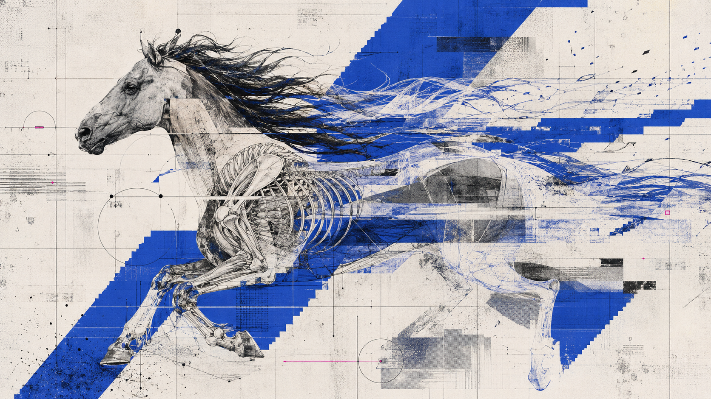
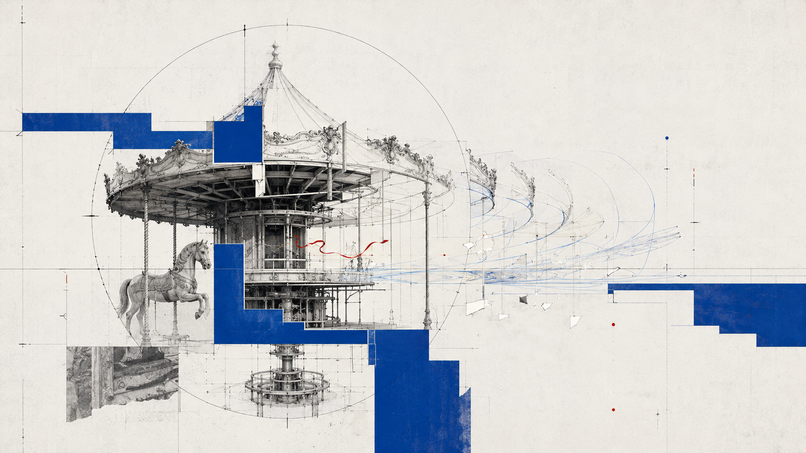
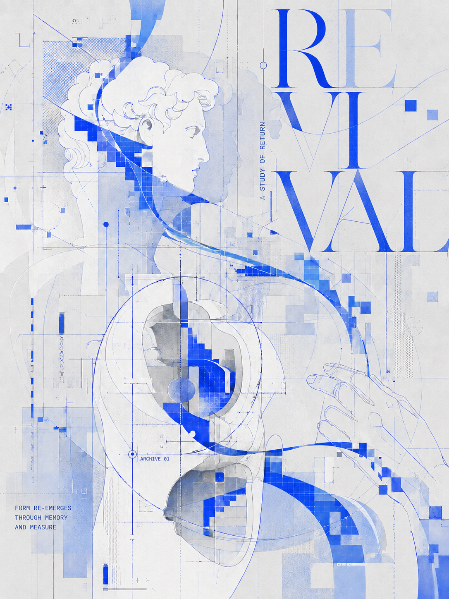

## Somniomancer-明日方舟众生行记美术风格SKILL
### 给我点点星标吧！！！！！求求了！！！


> Original consciousness-flow editorial visual skill · V1.1.1  
> 原创意识流档案式编辑视觉 Skill · V1.1.1

Somniomancer is a prompt-driven visual direction skill for creating original, non-photorealistic editorial key visuals. It turns a subject into sectional, sampled, cropped, and displaced graphic material, then lets that subject push back against an observing system.

Somniomancer 是一套用于生成原创实验编辑视觉的提示词 Skill。它不把主体当作写实插画，而是将其转译为剖面、取样、裁切、错位后的图形材料；再通过“系统施压”与“超出系统”建立画面的叙事张力。美术风格参考《明日方舟》中“众生行记”活动的美术风格

## What it controls / 可控项

```text
主体：[人 / 角色 / 动物 / 产品 / 建筑 / 抽象主题]
主施压：[测量 / 重复取样 / 坐标化 / 扫描切片 / 框定遮挡 / 错位抹除]
超出方式：[重影显现 / 轨迹扩散 / 断层褪印 / 光线渗出 / 碎片漂移 / 空间穿透]
情绪主词：[复兴 / 失真 / 见证 / 记忆 / 迁徙 / 重构等]
文案主题：[主题词或正文方向；可留空]
比例：[如 3:4、16:9、1:1]
```

The first three fields form the image's narrative engine. Mood and copy refine it.

前三项共同决定画面的叙事核心；情绪与文案用于进一步校准气质和排版。

## Visual principles / 视觉原则

- **Convert, do not reproduce.** The subject becomes sectional, sampled, flat, and cropped visual material—not a complete rendered illustration.
- **Structure before texture.** Archive-like tension is created with crop windows, coordinates, sampling, masking, and offset geometry. It is not created with dirty paper, all-over grain, or random distressing.
- **Blue must move.** Cobalt and ultramarine begin inside the subject, pass through it, get interrupted by white cutouts, and return elsewhere as an active structural field.
- **Title creates atmosphere; body copy carries information.** Large display type may be split, cropped, echoed, or knocked out. Small body text remains accurate and readable.

完整规则、提示词母版、修正方法与示例请见 [SKILL.md](SKILL.md)。

## Quick start / 快速使用

1. Download or clone this repository.
2. Keep the folder structure unchanged, especially `SKILL.md` and `assets/examples/`.
3. Install/import the folder or its ZIP into a compatible Skill environment.
4. Invoke `Somniomancer` and provide the six fields above.

不需要记住所有字段。导入后也可以直接说：

```text
列出 Somniomancer 可控项
```

Skill 会先给出主体、主施压、超出方式、情绪主词、文案主题、比例及可选增强项的菜单。你可以回复选项名称、编号或自行填写内容；若只先提供主体，Skill 只会追问最关键的下一项——**主施压**。

Example:

```text
主体：旋转木马
主施压：空间纵剖 + 坐标化
超出方式：重复旋转轨迹向右侧延伸
情绪主词：见证、迁徙、重构
文案主题：道路
比例：3:4
```

## Reference outputs / 参考案例

| Animal section | Architectural ritual machine | Fragmented human-form study |
| --- | --- | --- |
|  |  |  |

## License and permitted use / 许可与使用范围

This repository is publicly available for **personal learning, non-commercial experimentation, and non-commercial adaptation with attribution only**.

商业使用、商业服务、客户项目、付费产品、付费课程、广告营销、销售素材、模型训练与再分发售卖均被禁止。不得移除作者署名或将本项目改名后作为自己的原创方法发布。

Please read [LICENSE](LICENSE) before use. This is a **non-commercial public release**, not an OSI-approved open-source license.

请在使用前阅读 [LICENSE](LICENSE)。由于禁止商用，本项目属于“非商业公开发布”，而非 OSI 定义下的开源许可。

## Attribution / 署名

When sharing permitted adaptations, include:

```text
Based on Somniomancer V1.1 by FanYUJIU
https://github.com/<your-github-username>/somniomancer
```

Replace the placeholder URL after publishing the repository.

## Boundaries / 边界说明

Somniomancer is an independent visual-direction experiment. It is not affiliated with, endorsed by, or an official product of Hypergryph, Arknights, or any other referenced game, studio, artist, campaign, or rights holder. Do not use third-party copyrighted characters, logos, or reference images without the required permission.

本项目是独立的视觉方向实验，不隶属于、也未获任何游戏、工作室、艺术家、品牌或权利方授权。使用第三方角色、Logo 或参考图时，请自行确保拥有必要的授权。

## Contributing / 参与改进

Issues and non-commercial improvements are welcome. Please read [CONTRIBUTING.md](CONTRIBUTING.md) before submitting changes.
